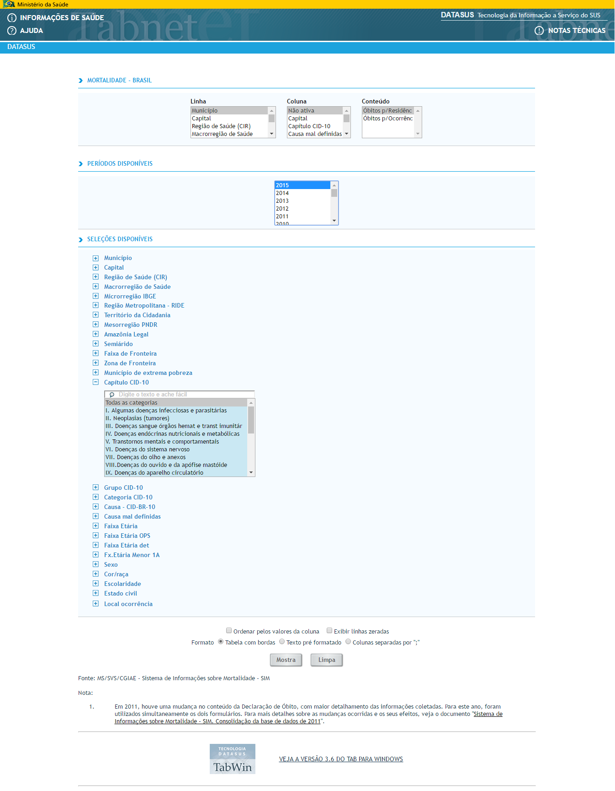

```{r setup, include=FALSE}
knitr::opts_chunk$set(echo = TRUE, collapse = TRUE, comment = "#>")
```

```{r results='hide', echo=FALSE, message=FALSE, warning=FALSE}
library(magrittr)
library(stringr)
library(dplyr)
```

## A R Interface to the DATASUS's data

The "datasus" R package seeks to provide direct access to the data of TABNET/DATASUS 
within the R environment much in the same way that is done in the online portal. For now
the package allows access to the systematic record of mortality and survival data 
(Vital Statistics - Mortality and Live Births) through SIM and SINASC's systems

## Installation

To install the development version hosted on Github:

```{r, eval=FALSE}
library(devtools)
install_github("rpradosiqueira/datasus")
```

## Functions

The functions are named by parts:

+ The 1st part is the data system (SIM or SINASC) where the data will be retrieved.
+ The 2nd is the type of the data, i.e., the inferior level of the data system; when they are accompained by a number, it concerns with the ICD version.
+ The 3rd is the geographic level of the data.

Then, for example we have:

```{r, eval=FALSE}
sinasc_nv_uf       Scrapes SINASC data from the states unities

sinasc_nv_mun      Scrapes SINASC data from municipalities
                   
sinasc_nv_bruf     Scrapes SINASC data from regions
                   
sim_obt10_uf       Scrapes SIM ICD-10 data from the states unities

sim_obt10_mun      Scrapes SIM ICD-10 data from cities

sim_obt10_bruf     Scrapes SIM ICD-10 data from regions

```		   

## Examples
### sinasc_nv_uf

1) Let's assume that we want the live births for the cities of the state of Mato Grosso do Sul. However, we will only recover the last five years and we want the cities to be in the rows and the years in the columns. To do this simply execute:

```{r, eval = FALSE}
library(datasus)

sinasc_nv_uf(uf = "ms",
             period = c(2011:2015),
             coluna = "Ano do nascimento")

```

```{r, echo = FALSE}
## Tabela obtida
library(datasus)

sinasc_nv_uf(uf = "ms",
             period = c(2011:2015),
             coluna = "Ano do nascimento")

```

-------

### sim_obt10_mun

2) In this example we will download the last mortality data for the IBGE's micro-region where the micro-regions are in the rows and the ICD-10 chapters in the columns (only 10 rows):

```{r, eval = FALSE}
sim_obt10_mun(linha = "Microrregião IBGE",
              coluna = "Capítulo CID-10")

```

```{r, echo = FALSE}
head(sim_obt10_mun(linha = "Microrregião IBGE",
                   coluna = "Capítulo CID-10"))

```

-------

## And so on...

The argument's input is written in the same way that is done in the online portal or in some cases it can be the order of the input according to the online layout.

Online access for mortality data by municipality:




