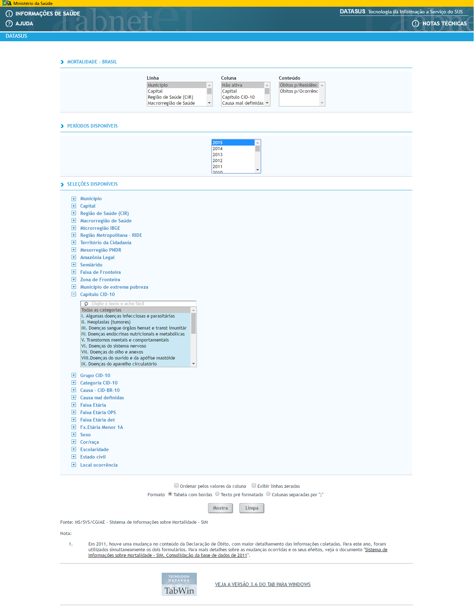

```{r setup, include=FALSE}
knitr::opts_chunk$set(echo = TRUE, collapse = TRUE, comment = "#>")
```

## A R Interface to the DATASUS's data

The "datasus" R package provides direct access to TABNET/DATASUS from R.
It covers vital statistics (SIM and SINASC), hospital production and
morbidity (SIH/SUS), ambulatory production (SIA/SUS), the National Registry
of Health Establishments (CNES), resident population estimates, and
notifiable conditions (SINAN). Historical immunization, nutritional
surveillance and financing tables and current SISCAN exam tables are also
available.

## Installation

To install the development version hosted on Github:

```{r, eval=FALSE}
library(devtools)
install_github("rpradosiqueira/datasus")
```

## Functions

Each system has one catalog-driven query function. Use
`datasus_catalogo()` for local discovery and `datasus_opcoes()` to inspect
the dimensions and filters currently published by TABNET. The historical
SIM and SINASC functions remain as deprecated compatibility wrappers.

## Examples

### SIM and SINASC

The unified vital-statistics functions cover all historical geographic
forms. `abrangencia = "uf"` returns region/state results; the default
municipal form covers Brazil, or one state when `uf` is supplied:

```{r, eval = FALSE}
datasus_catalogo("sim")
datasus_opcoes("sim", "obitos", abrangencia = "uf")

obitos_uf <- sim(
  "obitos",
  abrangencia = "uf",
  periodo = 2024
)

obitos_municipios <- sim(
  "obitos",
  uf = "MS",
  periodo = 2024,
  filtros = list(sexo = "Masculino")
)

nascimentos <- sinasc(uf = "MS", periodo = 2024)
datasus_proveniencia(obitos_uf)
```

### SIH/SUS, SIA/SUS and CNES

The three health-services systems share one interface. First inspect the
offline catalog and, when needed, the choices exposed by the current TABNET
form:

```{r, eval = FALSE}
datasus_catalogo()
datasus_catalogo("cnes")

op <- datasus_opcoes("sih", uf = "MS")
op$conteudo
op$filtros$carater_atendimento
```

Queries accept an exact period, `"last"`, or a year:

```{r, eval = FALSE}
sih_producao(
  uf = "MS",
  conteudo = "Internações",
  periodo = 2025,
  filtros = list(carater_atendimento = "Urgência")
)

sia_producao(uf = "MS", conteudo = "Qtd.aprovada")
cnes(uf = "MS")
cnes(conjunto = "leitos_internacao", uf = "MS")
```

### Population, hospital morbidity and SINAN

The same interface also covers population denominators, diagnosis-oriented
hospital morbidity, and 46 disease-specific SINAN datasets:

```{r, eval = FALSE}
populacao_residente(uf = "MS", periodo = 2021)

sih_morbidade(
  uf = "MS",
  linha = "Capítulo CID-10",
  conteudo = "Internações",
  periodo = 2025
)

datasus_catalogo("sinan")
sinan("dengue", uf = "MS", periodo = 2025)
```

### PNI, SISCAN, SISVAN and financing

The catalog also contains the legacy PNI, SISVAN and financing tables and 15
SISCAN exam datasets:

```{r, eval = FALSE}
pni_imunizacoes(uf = "MS")
pni_imunizacoes("cobertura", uf = "MS")

siscan(uf = "MS")
siscan("mamografia_residencia", uf = "MS", periodo = 2025)

sisvan(uf = "MS")
financiamento_sus(uf = "MS")
```

### OpenDataSUS microdata

OpenDataSUS publishes modern surveillance datasets as annual downloadable
resources. Search the portal and inspect the available files before starting
a large download:

```{r, eval = FALSE}
opendatasus_catalogo("dengue")
opendatasus_recursos("arboviroses-dengue")
```

Convenience functions cover SIVEP-Gripe, current dengue microdata and Mpox.
Use `n_max` to inspect a small sample first:

```{r, eval = FALSE}
srag <- sivep_gripe(ano = 2025, n_max = 1000)
dengue <- sinan_dengue(ano = 2025, n_max = 1000)
cases <- sinan_mpox(ano = 2025, n_max = 1000)

adverse_events <- esavi(n_max = 1000)
mild_cases <- esus_sindrome_gripal(
  uf = "MS",
  ano = "last",
  n_max = 1000,
  colunas = c(
    "dataNotificacao", "municipioIBGE", "idade", "sexo"
  ),
  normalizar = TRUE
)
doses <- pni_doses(
  ano = "last", mes = "last", n_max = 1000, normalizar = TRUE
)
occupancy <- ocupacao_hospitalar(
  ano = "last", n_max = 1000, normalizar = TRUE
)

datasus_proveniencia(dengue)
datasus_validar_esquema(
  doses,
  "pni_doses",
  campos = c("data_vacinacao", "cnes")
)
```

Files are downloaded atomically and cached. The provenance metadata includes
the official URL, resource identifier, update and download times, local path
and MD5 checksum. Set `atualizar = TRUE` to force a fresh copy. The syndrome
gripal wrapper resolves annual state files, PNI resolves one monthly file,
and `"last"` follows the latest partition actually published in the live
catalog rather than assuming the current calendar period.

Historical state resources may contain many physical lots in their
description. `opendatasus_arquivos()` expands these links and
`esus_sindrome_gripal()` joins them transparently while applying `n_max`
across the complete state selection. Use `opendatasus_processar()` when even
selected columns should not be held in memory:

```{r, eval = FALSE}
sg_resources <- opendatasus_recursos(
  "notificacoes-de-sindrome-gripal-leve-2020"
)
sg_ms <- sg_resources$id[
  sg_resources$formato == "CSV" &
    grepl("^Dados MS", sg_resources$nome)
]
summary <- opendatasus_processar(
  "notificacoes-de-sindrome-gripal-leve-2020",
  recurso = sg_ms,
  ano = NULL,
  colunas = c("municipioIBGE", "resultadoTeste"),
  tamanho_bloco = 50000,
  sistema = "sindrome_gripal",
  FUN = function(dados, posicao, arquivo) {
    table(dados$codigo_municipio_residencia)
  }
)
```

### Raw DBC/DBF microdata

Record-level SIM, SINASC and SIH files use the same discovery, download and
read workflow:

```{r, eval = FALSE}
microdados_catalogo()
microdados_arquivos("sih", ano = 2024, mes = 1, uf = "AC")

admissions <- sih_microdados(
  ano = 2024,
  mes = 1,
  uf = "AC",
  colunas = c("MUNIC_RES", "DT_INTER", "DIAG_PRINC", "VAL_TOT"),
  n_max = 1000,
  normalizar = TRUE
)

datasus_dicionario("sih")
datasus_proveniencia(admissions)
```

DBC files are decoded directly in memory. Selecting columns and limiting rows
is strongly recommended while exploring large monthly files.

### Territorial reference

The current IBGE hierarchy is available offline and links six-digit DATASUS
municipality codes to full seven-digit IBGE identifiers:

```{r, eval = FALSE}
datasus_territorios("regiao")
datasus_territorios("uf")
datasus_territorios("municipio", uf = "MS")

normalizar_codigo_ibge(c("500270", "500370"))

cases <- data.frame(
  codmun = c("500270", "500370"),
  ano = 2025,
  casos = c(10, 5)
)
adicionar_territorio(cases, "codmun")
```

Use `completar_territorios()` to create absent combinations for an explicit
period or territorial universe:

```{r, eval = FALSE}
completar_territorios(
  cases,
  codigo = "codmun",
  periodo = "ano",
  periodos = 2023:2025,
  preencher = list(casos = 0)
)
```

This hierarchy describes current territories. The package does not
automatically redistribute historical observations after boundary changes.

### Epidemiological analysis

The package includes dependency-free helpers for common calculations. The
integrated indicator engine aggregates numerator and denominator counts before
calculating grouped estimates:

```{r, eval = FALSE}
calcular_taxa(eventos = c(10, 25), populacao = c(10000, 20000))
intervalo_taxa(eventos = 10, populacao = 10000)

taxa_incidencia(
  dados,
  casos = "casos",
  populacao = "populacao",
  grupo = c("codigo_municipio", "ano"),
  confianca = 0.95
)
taxa_mortalidade(dados, "obitos", "populacao", grupo = "ano")
proporcao(dados, "vacinados", "elegiveis", grupo = "ano")
letalidade(dados, "obitos", "casos", grupo = "ano")
```

Use `juntar_populacao()` to make the denominator relationship explicit.
Population keys must be unique, observation order is preserved, and missing
matches raise an error by default:

```{r, eval = FALSE}
dados <- juntar_populacao(
  eventos,
  denominadores,
  por = c(codmun = "codigo_municipio", ano = "ano"),
  coluna_populacao = "habitantes"
)
```

Calendar and smoothing helpers remain vectorized:

```{r, eval = FALSE}
semana_epidemiologica(as.Date(c("2025-01-01", "2026-01-01")))
calendario_epidemiologico(2026)

media_movel(casos_diarios, janela = 7)
```

Direct standardization can use the bundled WHO 2000--2025, Segi or
Scandinavian reference weights:

```{r, eval = FALSE}
padronizar_idade(
  eventos = obitos_por_idade,
  populacao = habitantes_por_idade,
  idade = faixa_etaria,
  populacao_padrao = populacao_padrao("oms"),
  grupo = ano,
  confianca = 0.95
)
```

## Query conventions

Dimension and filter values can be supplied using the labels displayed by
TABNET, their raw values, or a one-based index where documented. Named
filters should always use the stable keys returned by `datasus_opcoes()`.

Online access for mortality data by municipality:




